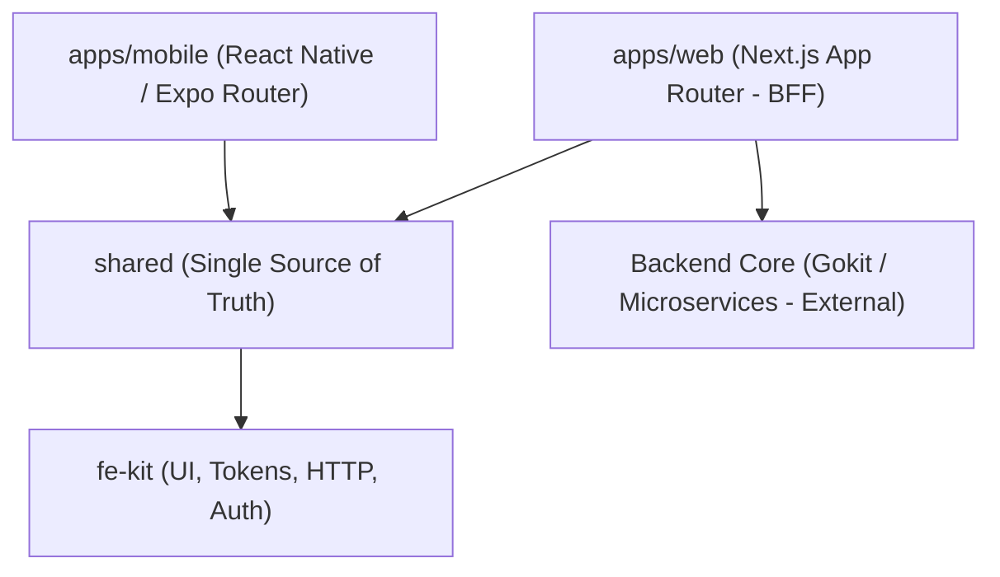
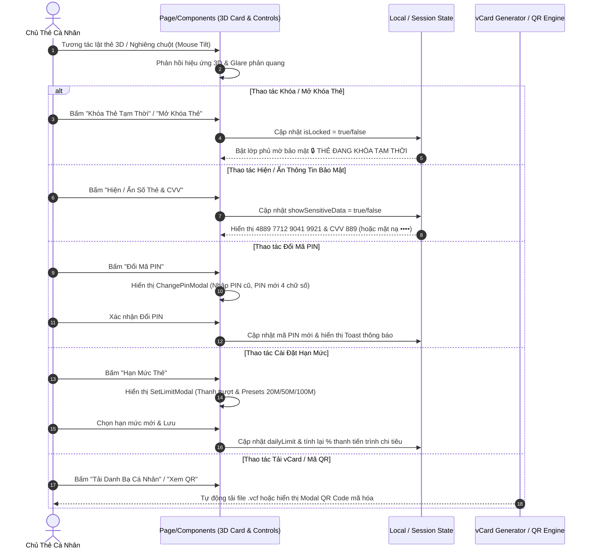

# LANDING.md — Tổng Quan Kiến Trúc & Luồng Hoạt Động Cardflow App

> Tài liệu này mô tả chi tiết kiến trúc tổng quan, luồng dữ liệu, quy chuẩn kỹ thuật và luồng vận hành của **Cardflow App — Hệ Thống Quản Lý 1 Thẻ Cá Nhân Duy Nhất**.

---

## 🏛 1. Kiến Trúc Tổng Quan (Architecture Overview)

Cardflow App được xây dựng theo mô hình **Monorepo (pnpm workspace + Turborepo)**, tích hợp chặt chẽ với bộ khung tiêu chuẩn **`fe-kit`**.



### Các Thành Phần Chính:

| Thư Mục / Package | Nhiệm Vụ & Trách Nhiệm |
|---|---|
| `apps/web` | Ứng dụng Web (Next.js App Router). Đóng vai trò **BFF (Backend-For-Frontend)**: Quản lý cookie phiên, bảo mật `client_secret`, map payload → view-model và render UI. |
| `apps/mobile` | Ứng dụng di động iOS/Android (Expo Router & React Native). Tương tác trực tiếp qua token cá nhân. |
| `shared/src/env.ts` | **Nguồn chân lý duy nhất (Single Source of Truth)** cho tất cả URL / API Endpoints. Chọn môi trường bằng biến `APP_ENV` (`uat` \| `beta` \| `prod`). |
| `shared/src/tokens.ts` | Bảng màu, font, spacing, radius của sản phẩm. Kết nối với `fe-kit/ui`. |
| `shared/src/api.ts` | Client HTTP gọi backend API thông qua `fe-kit/http`. |
| `fe-kit` | Bộ framework dùng chung cung cấp OIDC Auth, HTTP Client (envelope `{data}`/`{data,page}`, retry, 401), Token giao diện và Logger. |

---

## 🔄 2. Luồng Hoạt Động Hệ Thống (Data & Operation Flows)

### 2.1. Luồng Cấu Hình Môi Trường (Single Source of Truth)
```
User / System
   │
   ▼ (Khai báo 1 biến duy nhất)
APP_ENV ("uat" | "beta" | "prod")
   │
   ▼
shared/src/env.ts (defineEnvironments)
   │
   ▼
Tự động map toàn bộ Endpoint API chính xác cho Web & Mobile
```

### 2.2. Luồng Vận Hành Trải Nghiệm Người Dùng (User Journey Flow)

1. **Trang Giới Thiệu Sản Phẩm (`/`)**:
   - Mặc định truy cập vào trang Landing Showcase giới thiệu sản phẩm Thẻ Cá Nhân Thông Minh Cardflow.
   - Trình diễn hình ảnh 3D thẻ Bạch Kim, tính năng chạm NFC 1-giây, chip EMV bảo mật và các cột mốc công nghệ.
   - Nút điều hướng "Vào Dashboard" hoặc "Đăng nhập" dẫn người dùng sang Bảng Quản Lý Thẻ `/dashboard` hoặc trang SSO Login `/login`.

2. **Bảng Quản Lý Thẻ Cá Nhân (`/dashboard`)**:
   - Tập trung 100% vào trải nghiệm **Quản lý 1 Thẻ Cá Nhân duy nhất** (Personal Card Dashboard).



---

## 🎨 3. Quy Chuẩn Thiết Kế Frontend AI (Impeccable & fe-kit)

Hệ thống tuân thủ nghiêm ngặt bộ tiêu chuẩn **Skill Frontend AI (Impeccable)** từ bộ nhớ chung `2Cueos`:

1. **Một Sự Thật Một Chỗ**:
   - Tất cả mã màu, font-size, radius, spacing **BẮT BUỘC** khai báo tại `shared/src/tokens.ts`.
   - CẤM hardcode mã màu (`#2563eb`), giá trị px cứng trong JSX/CSS.
2. **Loại Bỏ Anti-Patterns Thiệt Kế AI**:
   - Tránh dùng màu đen/xám thuần (`#000`, `#888`); luôn pha màu chủ đạo (Tinting).
   - Tránh chữ xám trên nền màu. Tránh lồng Card trong Card.
   - Tránh font mặc định nguyên bản (`Arial`, `Inter`). Sử dụng `Plus Jakarta Sans` & `Outfit`.
   - Tránh hiệu ứng chuyển động nảy (Bounce/Elastic easing).
3. **Edge-case Readiness**:
   - Xử lý chỉn chu Loading state, Empty state, Error state, và Text Overflow cho mọi thiết bị.

---

## 🛡 4. Cổng Kiểm Tra Chất Lượng (Verify & Release Gate)

Trước khi commit code hoặc mở Merge Request (MR), dev/agent **bắt buộc** phải chạy lệnh:

```bash
pnpm verify
```

Lệnh này thực thi tuần tự 4 bước kiểm tra nghiêm ngặt:
1. `pnpm lint`: Đánh giá cú pháp và quy tắc bằng `oxlint` (Yêu cầu 0 warning, 0 error).
2. `pnpm type-check`: Kiểm tra kiểu dữ liệu toàn bộ workspace (`tsc --noEmit`).
3. `pnpm build`: Biên dịch production bundle cho Next.js Web (`apps/web`) và Expo Mobile (`apps/mobile`).
4. `pnpm test`: Chạy unit tests.

> *Lưu ý: `type-check` KHÔNG thay thế được `build` vì ranh giới server/client của Next.js chỉ bộc lộ lúc build.*

---

## 🤖 5. Đồng Bộ Tri Thức AI Agent (TencentDB Shared Memory)

Hệ thống được kết nối với bộ nhớ chung **TencentDB Agent Memory** qua 2 kênh MCP:
- **MCP Server `3fe`** (`wiki-iu819qwl`): Lưu trữ tri thức, quy chuẩn riêng của dự án Cardflow App.
- **MCP Server `2Cueos`** (`wiki-9sr5qg3i`): Lưu trữ tri thức hệ sinh thái CueOS, quy chuẩn Frontend AI và hướng dẫn dùng chung.
